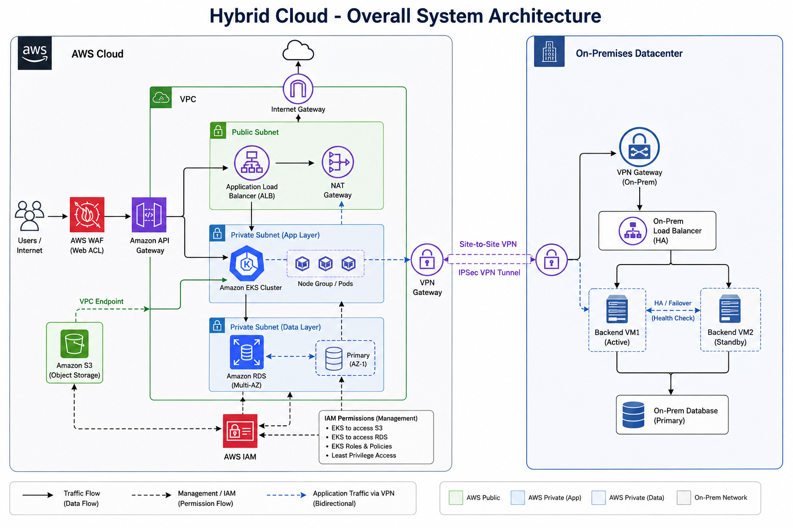
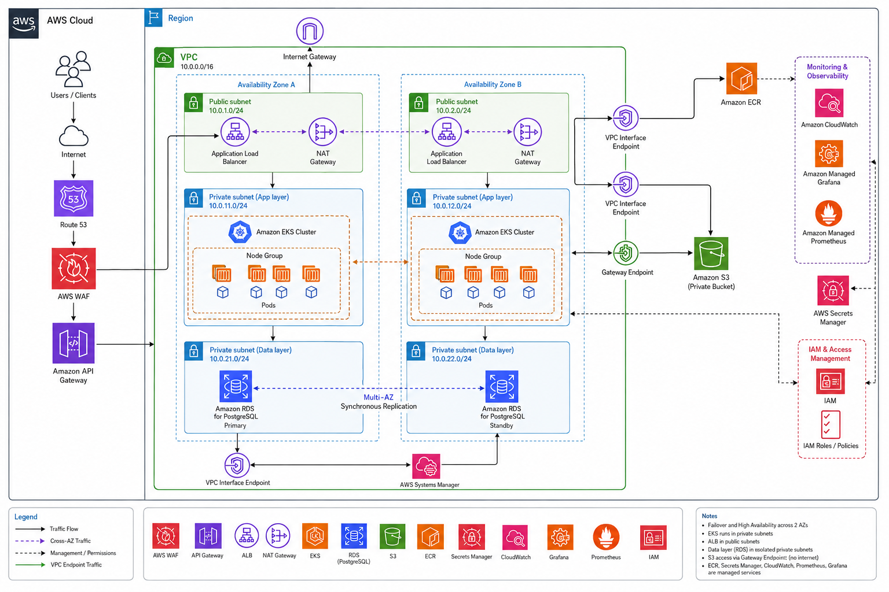
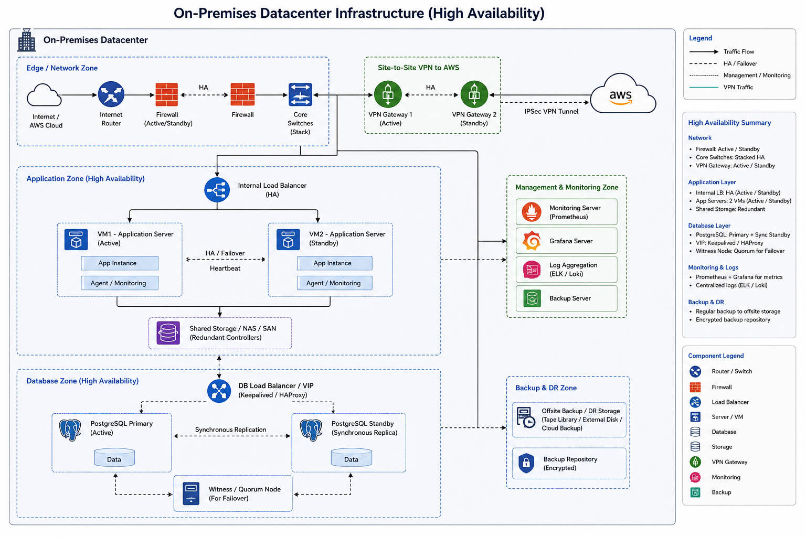
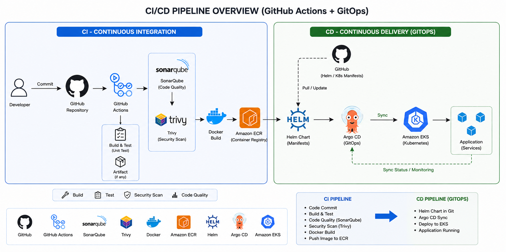

# Infrastructure Specification

Tài liệu này mô tả chi tiết kiến trúc hạ tầng của hệ thống EasyTicket, bao gồm 4 sơ đồ chính: kiến trúc tổng thể, kiến trúc AWS, kiến trúc On-Premises, và CI/CD Pipeline.

---

## 1. Overall System Architecture



### Tổng quan

Hệ thống EasyTicket sử dụng mô hình **Hybrid Cloud** kết hợp giữa AWS (cloud) và On-Premises (on-prem), cho phép linh hoạt trong việc triển khai và mở rộng theo nhu cầu.

### Các thành phần chính

| Layer | Thành phần | Mô tả |
|-------|------------|-------|
| **Client** | Browser, Desktop App | Giao diện người dùng cuối |
| **CDN & DNS** | Route 53, CloudFront | DNS routing và CDN distribution |
| **Security** | ACM, WAF | SSL/TLS termination và Web Application Firewall |
| **Networking** | VPC, Load Balancer | Virtual network và request routing |
| **Application** | API Gateway, Microservices | Business logic và API endpoints |
| **Data** | PostgreSQL, Redis, S3 | Database, cache, và object storage |
| **Messaging** | RabbitMQ, Kafka | Message queue cho inter-service communication |
| **Monitoring** | CloudWatch | Logging và monitoring |

### Data Flow

```
User Request
    ↓
Browser/Desktop App
    ↓
CloudFront (CDN)
    ↓
Route 53 (DNS)
    ↓
WAF (Security Layer)
    ↓
Application Load Balancer
    ↓
┌─────────────────────────────────────────┐
│  Microservices (ECS/EC2)                │
│  ├── API Gateway                        │
│  ├── Auth Service                       │
│  ├── User Service                       │
│  ├── Event Service                      │
│  └── Ticket Service                     │
└─────────────────────────────────────────┘
    ↓                    ↓
PostgreSQL (Primary)  Redis (Cache)
    ↓
S3 (File Storage)
    ↓
RabbitMQ / Kafka (Message Queue)
```

---

## 2. AWS Cloud Architecture



### VPC Architecture

Hệ thống AWS được triển khai trong **Virtual Private Cloud (VPC)** với cấu trúc multi-subnet:

```
┌─────────────────────────────────────────────────────────┐
│                     AWS Region                           │
│  ┌───────────────────────────────────────────────────┐  │
│  │                    VPC (10.0.0.0/16)               │  │
│  │                                                   │  │
│  │  ┌─────────────┐    ┌─────────────────────────┐  │  │
│  │  │   Public     │    │       Private Subnet    │  │  │
│  │  │   Subnet     │    │  ┌───────────────────┐  │  │  │
│  │  │  (AZ 1 & 2)  │    │  │ ECS Fargate       │  │  │  │
│  │  │              │    │  │ Services          │  │  │  │
│  │  │  ┌─────────┐ │    │  │ - API Gateway    │  │  │  │
│  │  │  │   ALB   │ │◄───┼──│ - Auth Service   │  │  │  │
│  │  │  └─────────┘ │    │  │ - User Service   │  │  │  │
│  │  │              │    │  │ - Event Service  │  │  │  │
│  │  └──────────────┬┘    │  │ - Ticket Service │  │  │  │
│  │                 │     │  └───────────────────┘  │  │  │
│  │                 │     └─────────────────────────┘  │  │
│  │                 │                                    │  │
│  │  ┌─────────────┴┐    ┌─────────────────────────┐   │  │
│  │  │   NAT        │    │    RDS Subnet Group      │   │  │
│  │  │   Gateway    │────│  ┌───────────────────┐   │   │  │
│  │  └──────────────┘    │  │  │ RDS PostgreSQL   │   │   │  │
│  │                      │  │  │ (Multi-AZ)       │   │   │  │
│  │                      │  │  └───────────────────┘   │   │  │
│  │                      │  └─────────────────────────┘  │  │
│  │                      │                                  │  │
│  └──────────────────────┼──────────────────────────────┘  │
└─────────────────────────┼──────────────────────────────────┘
                          │
    ┌─────────────────────┴─────────────────────┐
    │            Internet Gateway                 │
    └────────────────────────────────────────────┘
                          │
              ┌───────────┴───────────┐
              │   Route 53 + CloudFront │
              │   + ACM + WAF           │
              └─────────────────────────┘
```

### AWS Services chi tiết

| Service | Loại | Mục đích |
|---------|------|----------|
| **Route 53** | DNS | Quản lý DNS, health checks, routing policies |
| **CloudFront** | CDN | Edge caching, DDoS protection, low latency |
| **ACM (Certificate Manager)** | Security | Tự động cấp và renew SSL/TLS certificates |
| **WAF (Web Application Firewall)** | Security | Bảo vệ against OWASP top 10, rate limiting |
| **Application Load Balancer** | Networking | Layer 7 load balancing, path-based routing |
| **ECS Fargate** | Compute | Serverless container runtime cho microservices |
| **RDS PostgreSQL** | Database | Managed PostgreSQL với Multi-AZ replication |
| **ElastiCache Redis** | Cache | In-memory caching, session store |
| **S3** | Storage | Object storage cho files, images, backups |
| **CloudWatch** | Monitoring | Logging, metrics, alarms |

### High Availability

- **Multi-AZ Deployment**: RDS PostgreSQL với 1 primary và 2 standby replicas
- **Auto Scaling**: ECS Fargate tự động scale theo traffic
- **Redundant NAT**: NAT Gateway trong mỗi Availability Zone
- **Health Checks**: ALB kiểm tra health của ECS tasks

---

## 3. On-Premises Architecture



### Tổng quan

Môi trường On-Premises sử dụng **Hyper-V virtualization** và **Kubernetes** để deploy và quản lý các microservices, cùng với **Kafka** làm message broker thay vì RabbitMQ.

### Cấu trúc Hyper-V Cluster

```
┌─────────────────────────────────────────────────────────────┐
│                    Hyper-V Cluster                          │
│  ┌──────────────────┐    ┌──────────────────┐             │
│  │   Hyper-V Host 1  │    │   Hyper-V Host 2  │             │
│  │  ┌────────────┐  │    │  ┌────────────┐  │             │
│  │  │Kubernetes  │  │    │  │Kubernetes  │  │             │
│  │  │Master VM   │  │    │  │Master VM   │  │             │
│  │  └────────────┘  │    │  └────────────┘  │             │
│  │  ┌────────────┐  │    │  ┌────────────┐  │             │
│  │  │ Worker VM  │  │    │  │ Worker VM  │  │             │
│  │  │  (App 1)   │  │    │  │  (App 2)   │  │             │
│  │  └────────────┘  │    │  └────────────┘  │             │
│  │  ┌────────────┐  │    │  ┌────────────┐  │             │
│  │  │ Worker VM  │  │    │  │ Worker VM  │  │             │
│  │  │  (App 3)   │  │    │  │  (App 4)   │  │             │
│  │  └────────────┘  │    │  └────────────┘  │             │
│  └──────────────────┘    └──────────────────┘             │
└─────────────────────────────────────────────────────────────┘
                          │
        ┌─────────────────┼─────────────────┐
        │                 │                 │
        ▼                 ▼                 ▼
  ┌──────────┐     ┌──────────┐     ┌──────────┐
  │PostgreSQL│     │  Redis   │     │  Kafka   │
  │ Cluster  │     │ Cluster  │     │ Cluster  │
  └──────────┘     └──────────┘     └──────────┘
```

### Kubernetes Architecture

| Component | Mô tả | Số lượng |
|-----------|-------|----------|
| **Master Node** | API Server, etcd, Scheduler, Controller Manager | 3 (HA) |
| **Worker Node** | Chạy application pods | 3+ |
| **Ingress Controller** | Nginx-based reverse proxy, SSL termination | 2 |
| **CSI Driver** | Container Storage Interface | - |

### So sánh AWS vs On-Premises

| Thành phần | AWS | On-Premises |
|------------|-----|-------------|
| **Compute** | ECS Fargate | Kubernetes on Hyper-V |
| **Database** | RDS PostgreSQL | PostgreSQL Cluster |
| **Cache** | ElastiCache Redis | Redis Cluster |
| **Message Queue** | RabbitMQ | Apache Kafka |
| **Load Balancer** | ALB | Nginx Ingress |
| **Storage** | S3 | Local/NFS Storage |
| **Monitoring** | CloudWatch | Prometheus + Grafana |

---

## 4. CI/CD Pipeline



### Pipeline Overview

Hệ thống CI/CD sử dụng **GitHub Actions** với quy trình tự động từ code commit đến production deployment.

### Pipeline Stages

```
┌─────────────────────────────────────────────────────────────────────┐
│                     CI/CD Pipeline Flow                             │
└─────────────────────────────────────────────────────────────────────┘

  ┌─────────────┐
  │    Code      │
  │  (Push to    │
  │   branch)    │
  └──────┬───────┘
         │
         ▼
  ┌─────────────┐
  │    Build     │
  │  (Compile,   │
  │   Bundle)    │
  └──────┬───────┘
         │
         ▼
  ┌─────────────┐
  │    Test      │
  │ (Unit, Int,  │
  │   E2E)       │
  └──────┬───────┘
         │
         ▼
  ┌─────────────┐
  │    Push      │
  │  (Docker     │
  │  Registry)   │
  └──────┬───────┘
         │
         ▼
  ┌─────────────┐     ┌─────────────┐     ┌─────────────┐
  │   Deploy    │────▶│   Deploy    │────▶│   Deploy    │
  │    Dev      │     │   Staging   │     │  Production │
  └─────────────┘     └─────────────┘     └─────────────┘
```

### Chi tiết từng Stage

#### Stage 1: Build
```yaml
- Checkout code
- Setup Node.js/Python/Go environment
- Install dependencies (npm install, pip install, etc.)
- Build application (npm run build, etc.)
```

#### Stage 2: Test
```yaml
- Unit Tests (Jest, Pytest, Go test)
- Integration Tests
- E2E Tests (Cypress, Playwright)
- Security Scans (SAST, Dependency Check)
- Code Coverage Report
```

#### Stage 3: Push
```yaml
- Login to Docker Registry (ECR/ACR)
- Build Docker Image
- Tag Image (commit SHA, branch, latest)
- Push to Registry
- Update Helm Chart/Deployment manifest
```

#### Stage 4: Deploy

| Environment | Trigger | Approval |
|-------------|---------|----------|
| **Development** | Push to `develop` branch | Automatic |
| **Staging** | Push to `main` branch | Manual approval |
| **Production** | Release tag (v*.*.*) | Manual approval + Rollback plan |

### Deployment Targets

| Target | Infrastructure | Strategy |
|--------|---------------|----------|
| **Dev** | AWS ECS Dev Cluster | Rolling update |
| **Staging** | AWS ECS Staging Cluster | Blue/Green |
| **Production** | AWS ECS Production Cluster | Blue/Green + Canary |

### Rollback Strategy

1. **Automatic Rollback**: Triggered on health check failure
2. **Manual Rollback**: Via GitHub Actions workflow dispatch
3. **Rollback Commands**:
   ```bash
   # ECS Rollback
   aws ecs update-service --service api --region us-east-1 --force-new-deployment
   
   # Kubernetes Rollback
   kubectl rollout undo deployment/api -n production
   ```

---
